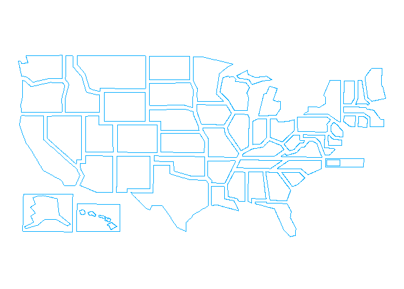

<!-- README.md is generated from README.Rmd. Please edit that file -->

# map1968

<!-- badges: start -->

<!-- badges: end -->

This is a quick project to plot lovable hand-drawn esque election maps
to the style of the New York Times’ 1968 election map:

<center>


</center>

Inspired by [this
tweet](https://twitter.com/alv9n/status/1319013784346906629) showing
interest in the simple, yet elegant polygons created for this map, I
decideed to trace the map as an svg and georeference to a geojson file,
so someone could easily plot this map with fill based on vote count or
other data.

The map is available as an svg in this repo with path ids defined as the
state postal code:


It is also available as a plottable geojson file.

Simply read in the file, tidy it, and plot it with geom\_polygon.

``` r

library(geojsonio)
#> Warning: package 'geojsonio' was built under R version 4.0.3
#> 
#> Attaching package: 'geojsonio'
#> The following object is masked from 'package:base':
#> 
#>     pretty
library(broom)
library(sp)
library(dplyr) #for pipes
#> 
#> Attaching package: 'dplyr'
#> The following objects are masked from 'package:stats':
#> 
#>     filter, lag
#> The following objects are masked from 'package:base':
#> 
#>     intersect, setdiff, setequal, union

spdf <- geojsonio::geojson_read("./elections_features.geojson",  what = "sp")


spdf_fortified <- broom::tidy(spdf) %>% dplyr::filter(!id==1)
#> Regions defined for each Polygons

library(ggplot2)

ggplot() +
  geom_polygon(data = spdf_fortified, aes( x = long, y = lat, group = group), fill = NA, colour = "#00abff") +
  theme_void() +
  coord_map()
```

<!-- -->

The plan is to set each polygon to have the state postal code to be
easily bound to election data before the 2020 presidential election.

Feel free to clone or fork the repo if you would like to use the files
or [DM me](https://twitter.com/_willdebras) if you have questions.
